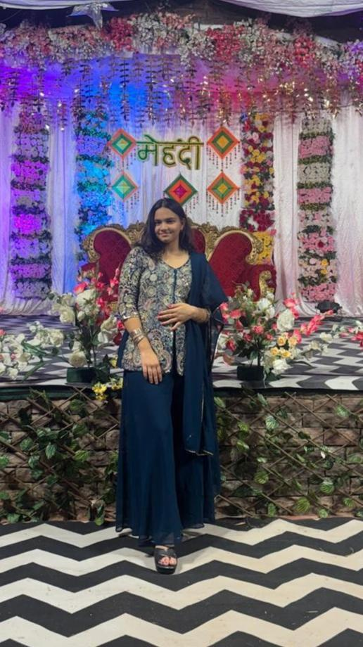
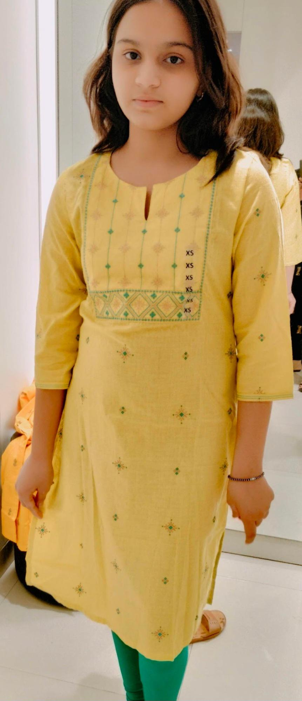

# sorry-avikaa
<!DOCTYPE html>
<html>
<head>
<title>Sorry Avika ❤️</title>

</head>

<body>

<h1>I'm Sorry Avika ❤️</h1>

💖 💗 💖

Avika, mujhe pata hai tum mujhse gussa ho.  
Mera intention kabhi bhi tumhe hurt karna nahi tha.  
Tum meri life me bahut important ho.  
Please mujhe maaf kar do Madam ji.  
I promise main future me better banunga.

<h2>Letter for You 💌</h2>

Dear Avika,  

Kabhi kabhi humse galti ho jati hai.  
Par iska matlab ye nahi ki hum care nahi karte.  
Tum mere liye bahut special ho.  
Please gussa mat raho.  

  
– Nitin ❤️

</body>
</html>
